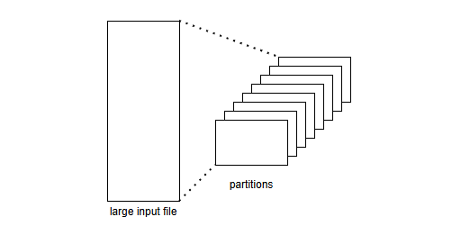
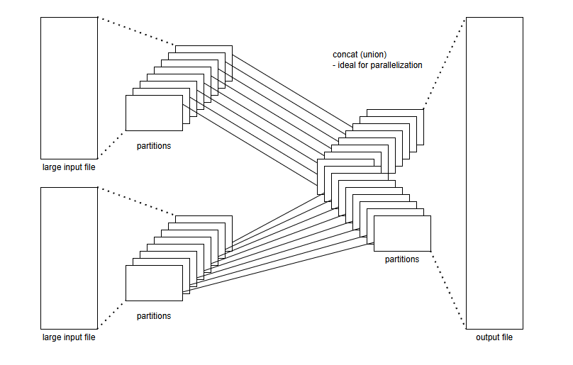
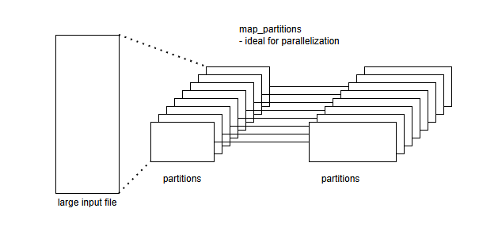
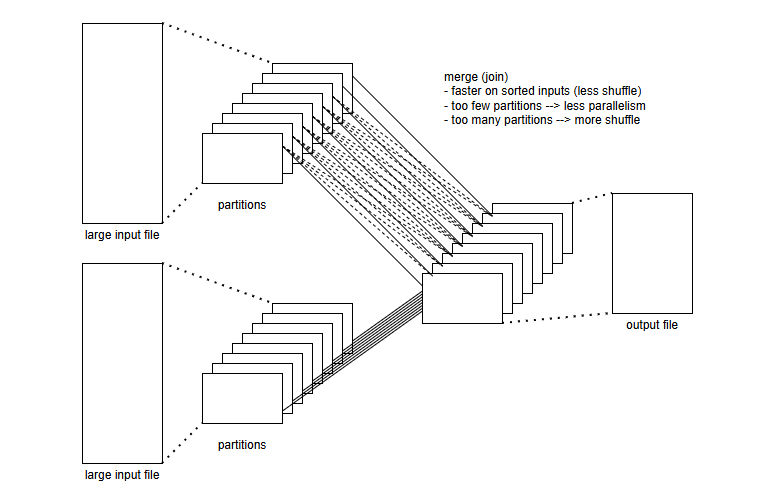
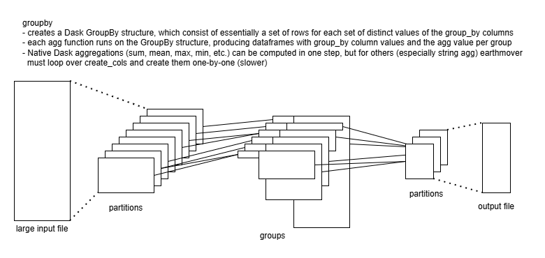
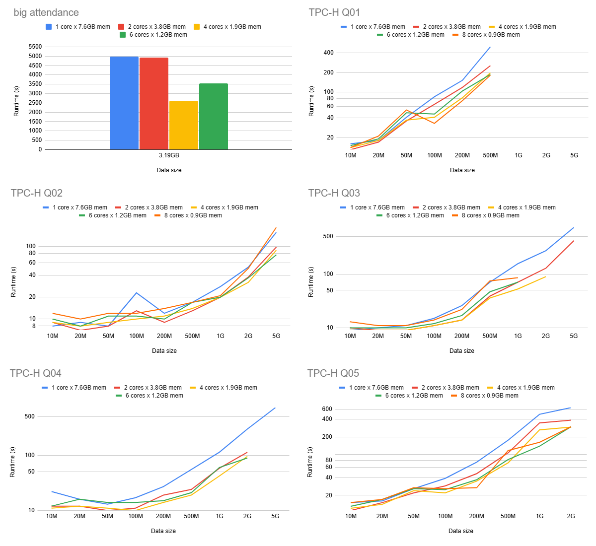

This page discusses some aspects of `earthmover`'s design.

## YAML compilation
`earthmover` [allows Jinja templating expressions in its YAML configuration files](usage.md#jinja-in-yaml-configuration). (This is similar to how [Ansible Playbooks](https://docs.ansible.com/ansible/latest/playbook_guide/playbooks.html) work.) `earthmover` parses the YAML in several steps:

1. Extract only the [`config` section](configuration.md#config) (if any), in order to make available any `macros` when parsing the rest of the Jinja + YAML. The `config` section *only* **may not contain any Jinja** (besides `macros`).
1. Load the entire Jinja + YAML as a string and hydrate all [parameter](usage.md#parameters) references.
1. Parse the hydrated Jinja + YAML string with any `macros` to plain YAML.
1. Load the plain YAML string as a nested dictionary and begin building and processing the [DAG](design.md#data-dependency-graph-dag).

Note that due to step (3) above, *runtime* Jinja expressions (such as column definitions for `add_columns` or `modify_columns` operations) should be wrapped with `...` to avoid being parsed when the YAML is being loaded.

The parsed YAML is written to a file called `earthmover_compiled.yaml` in your working directory during a `compile` command. This file can be used to debug issues related to compile-time Jinja or [project composition](usage.md#project-composition).

## Data dependency graph (DAG)
`earthmover` models the `sources` &rarr; `transformations` &rarr; `destinations` data flow as a directed acyclic graph ([DAG](https://en.wikipedia.org/wiki/Directed_acyclic_graph)). `earthmover` will raise an error if your [YAML configuration](configuration.md#yaml-configuration) is not a valid DAG (if, for example, it contains a [cycle](https://en.wikipedia.org/wiki/Cycle_(graph_theory))).

Each [component](https://en.wikipedia.org/wiki/Component_(graph_theory)) of the DAG is run separately.

Each component is materialized in [topological order](https://en.wikipedia.org/wiki/Topological_sorting). This minimizes memory usage, as only the data from the current and previous layer must be retained in memory.

!!! tip "Tip: visualize an earthmover DAG"

    Setting [`config`](configuration.md#config) &raquo; `show_graph: True` will make `earthmover run` produce a visualization of the DAG for a project, such as

    

    In this diagram:

    * Green nodes on the left correspond to [`sources`](configuration.md#sources)
    * Blue nodes in the middle correspond to [`transformations`](configuration.md#transformations)
    * Red nodes on the right correspond to [`destinations`](configuration.md#destinations)
    * `sources` and `destinations` are annotated with the file size (in <u>B</u>ytes)
    * all nodes are annotated with the number of <u>r</u>ows and <u>c</u>olumns of data at that step

## Dataframes
All data processing is done using [Pandas Dataframes](https://pandas.pydata.org/docs/reference/api/pandas.DataFrame.html) and [Dask](https://www.dask.org/), with values stored as strings (or [Categoricals](https://pandas.pydata.org/docs/user_guide/categorical.html), for memory efficiency in columns with few unique values). This choice of datatypes prevents issues arising from Pandas' datatype inference (like inferring numbers as dates), but does require casting string-representations of numeric values using Jinja when doing comparisons or computations.

## Comparison to `dbt`
`earthmover` is similar in a number of ways to [`dbt`](). Some ways in which the tools are similar include...

* both are open-source data transformation tools
* both use YAML project configuration
* both manage data dependencies as a DAG
* both manage data transformation as code
* both support packages (reusable data transformation modules)

But there are some significant differences between the tools too, including...

* `earthmover` runs data transformations locally, while `dbt` issues SQL transformation queries to a database engine for execution. (For database `sources`, `earthmover` downloads the data from the database and processes it locally.)
* `earthmover`'s data transformation instructions are `operations` expressed as YAML, while `dbt`'s transformation instructions are (Jinja-templated) SQL queries.

The team that maintains `earthmover` also uses (and loves!) `dbt`. Our data engineers typically use `dbt` for large datasets (GB+) in a cloud database (like Snowflake) and `earthmover` for smaller datasets (< GB) in files (CSV, etc.).

## Performance
Tool performance depends on a variety of factors including source file size and/or database performance, the system's storage performance (HDD vs. SSD), memory, and transformation complexity. But some effort has been made to engineer this tool for high throughput and to work in memory- and compute-constrained environments.

Smaller source data (which all fits into memory) processes very quickly. Larger chunked sources are necessarily slower. We have tested with sources files of 3.3GB, 100M rows (synthetic attendance data): creating 100M lines of JSONL (30GB) takes around 50 minutes on a modern laptop.

The [state feature](usage.md#state) adds some overhead, as hashes of input data and JSON payloads must be computed and stored, but this can be disabled if desired.

### Parallel Processing
`earthmover` supports [parallel processing](./usage#parallel-processing) across several CPU cores via [Dask distributed](https://distributed.dask.org/en/stable/) with a [LocalCluster](https://distributed.dask.org/en/stable/api.html#cluster). In this section we discuss how this works, and give some performance benchmark data.

A core innovation of [Dask](https://www.dask.org/) is representation of dataframes as a collection of [partitions](https://docs.dask.org/en/latest/dataframe-design.html#partitions), each being a [Pandas dataframe](https://pandas.pydata.org/docs/reference/api/pandas.DataFrame.html). This, together with writing intermediate Pandas partitions to disk as needed and clever re-implementation of some Pandas dataframe methods, enable Dask to _handle dataframes larger than memory_ - the main reason we initially built earthmover on Dask.

Once data is partitioned, it becomes possible to _process_ it in parallel - this is the functionality that [Dask distributed](https://distributed.dask.org/en/stable/) provides. It consists of
1. a scheduler
1. a cluster of Dask workers - which can be CPU cores on a single machine (how earthmover works) or even separate machines on a network

The scheduler (1) carves up data transformations on an entire dataframe into a graph of smaller transformations on each partition ("tasks"), and it coordinates tasks across the workers (2).

Next, we discuss how [earthmover's `operations`]() work with Dask's partitioning.

#### `union`
Union is quite straightforward; the partitions of two (or more) dataframes are stacked to form a single larger dataframe.

#### column operations
[Column operations](./configuration#column-operations) such as `add_columns`, `modify_columns`, `keep_columns`, `drop_columns`, `map_values`, etc. can be applied to each partition separately, and so are highly parallelizable. They can increase the size of partitions; in this case, one can keep partitions smaller specifying a `source`'s `blocksize` smaller than the default `25MB`.

#### `join`
Join can be fast and parallelizable _if_ both frames are sorted on the join key(s) - then each worker can take one or a few partitions from each dataframe and join those (in memory). If one or both dataframes are large and not sorted, then each partition from one dataframe may need to be joined against every partition of the other dataframe (the dotted lines in the picture below), which is _much_ slower.

#### `group_by`
Group-by also benefits from sorted input - each worker produces a few groups, and communication between workers is minimized.

### Distributed benchmarks
To understand the performance characteristics of `earthmover[distributed]`, we have run a battery of workloads and configurations. We present some data below.

* **big attendance** is a fairly simple workload that takes a 1B-row, 3.2GB TSV input file (of school attendance data) that produces a 1B-line 27.9GB JSONL output file.
* **TCP-H query X** are earthmover implementations of the first 5 of [the canonical TPC-H queries](https://github.com/dragansah/tpch-dbgen/tree/master/tpch-queries). (TPC-H is a standard data [schema](https://docs.snowflake.com/en/user-guide/sample-data-tpch) representing a business's operations: parts, suppliers, orders, customers, etc. It has been used for decades to test relational database systems.) We used [tcph-kit](https://github.com/gregrahn/tpch-kit) to generate various (doubling) sizes (from about 10MB to 5GB) of the TPC-H dataset.
    - **TPC-H query 1** excercises `group_by`: it selects from a single table, filter rows by date, groups by statuses and computes sum and average of several columns, and finally sorts result by statuses. (The query ultimately produces very few rows, less than a dozen.)
    - **TPC-H query 2** exercises `join`: it computes account balances for suppliers via selecting from 5 tables (joined together), filtering rows by supplier region and part type and size, and finally sorting the result by balance and other fields. (Our `earthmover.yml` implementation pushes the filters up front, to minimize the number of rows that must be joined.)
    - **TPC-H query 3** exercises `join` and `group_by`: it computes revenue per order via selecting from 3 tables (joined together), filtering rows by market segment and for a specific date, grouping by several order-related fields, and finally sort the result by revenue and order date.
    - **TPC-H query 4** exercises `join` and `group_by`: it computes the number of orders by priority over a certain date range via selecting from one table, filtering rows by a specific date range, grouping by order priority, ad finally sorting result by order priority.
    - **TPC-H query 5** exercises `join` and `group_by`: it computes revenue by country over a certain date range via selecting from 6 tables, filtering rows by a specific date range, grouping by country name with sum a revenue expression, and finally sorting result by revenue.
* (Missing datapoints above indicate runs that did not complete successfully in a reasonable amount of time - typically either Dask killed all workers, or Dask got stuck in a loop where workers are replaced and their tasks retried.)

#### Benchmark takeaways:
* earthmover distributed can cut runtimes in half (or better)
* 4 workers generally performs best - likely a good balance between parallelism and communication overhead
* eventually memory - not compute - becomes the constraint; without enough memory, workers may not successfully complete

### Distributed FAQs
* **When should I use distributed?** 
* **What's an optimal configuration?** 

